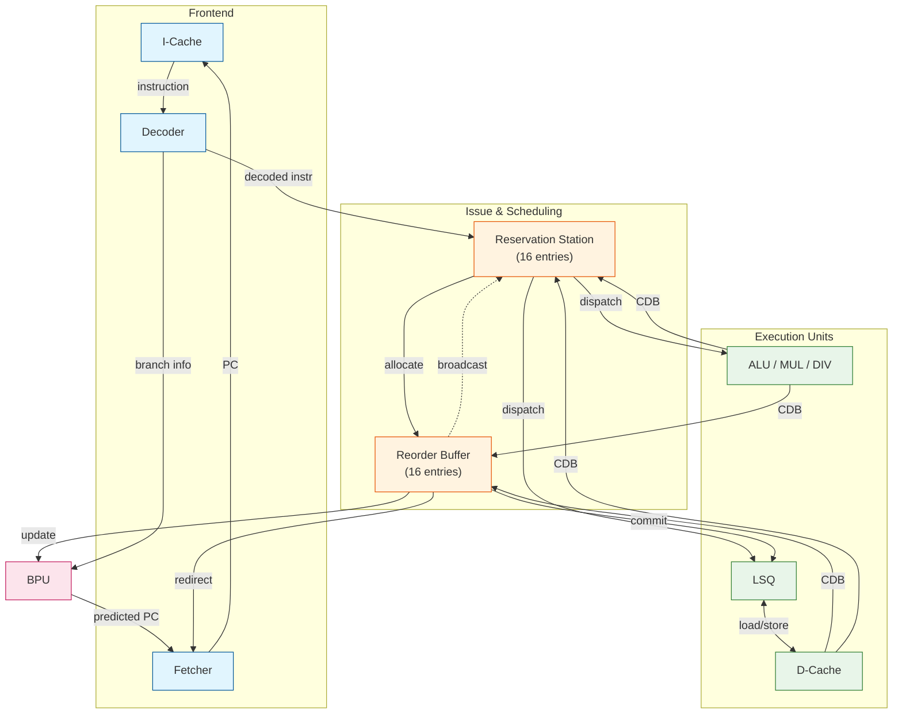

# RISC-V Out-of-Order CPU Project Report

> **Course**: CS2967  
> **Framework**: [Assassyn](https://github.com/Synthesys-Lab/assassyn.git)  
> **ISA**: RISC-V RV32IM

---

## Table of Contents

1. [Project Overview](#1-project-overview)
2. [System Architecture](#2-system-architecture)
3. [Core Components](#3-core-components)
   - 3.1 [Instruction Fetch](#31-instruction-fetch-fetcher)
   - 3.2 [Instruction Decode](#32-instruction-decode-decoder)
   - 3.3 [Reservation Station](#33-reservation-station-rs)
   - 3.4 [Reorder Buffer](#34-reorder-buffer-rob)
   - 3.5 [Execution Units](#35-execution-units)
   - 3.6 [Load/Store Queue](#36-loadstore-queue-lsq)
   - 3.7 [Branch Prediction Unit](#37-branch-prediction-unit-bpu)
4. [M Extension Implementation](#4-m-extension-implementation)
   - 4.1 [Multiplier](#41-multiplier-radix-4-booth)
   - 4.2 [Divider](#42-divider-restoring-division)
5. [Branch Predictor Design](#5-branch-predictor-design)
6. [Implementation Details](#6-implementation-details)
7. [Benchmark Results](#7-benchmark-results)
8. [Conclusion](#8-conclusion)

---

## 1. Project Overview

This project implements an **out-of-order execution RISC-V CPU simulator** using the classic **Tomasulo algorithm**. The CPU supports the **RV32IM** instruction set, including the base integer instructions (RV32I) and the multiply/divide extension (M).

### Key Features

- **Out-of-Order Execution**: Tomasulo algorithm with register renaming
- **Speculative Execution**: Branch prediction with multiple predictor options
- **Pipelined Multiply/Divide**: 4-stage pipelined multiplier and divider
- **Memory Disambiguation**: Load/Store Queue with forwarding support
- **Precise Exceptions**: Reorder Buffer ensures in-order commit

### Project Structure

```
RISC-V-CPU/
├── cpu/                    # CPU core modules
│   ├── alu.py              # Arithmetic Logic Unit
│   ├── bpu.py              # Branch Prediction Unit
│   ├── decoder.py          # Instruction Decoder
│   ├── divider.py          # 4-stage Pipelined Divider
│   ├── fetcher.py          # Instruction Fetcher
│   ├── instruction.py      # Instruction Definitions
│   ├── lsq.py              # Load/Store Queue
│   ├── multiplier.py       # Radix-4 Booth Multiplier
│   ├── rob.py              # Reorder Buffer
│   ├── rs.py               # Reservation Station
│   └── utils.py            # Utility functions
├── workload/               # Test programs (21 benchmarks)
├── docs/                   # Documentation
└── main.py                 # Main entry point
```

---

## 2. System Architecture

The CPU implements the Tomasulo algorithm with the following pipeline stages:



### Execution Flow

1. **Fetch**: Fetcher retrieves instruction from I-Cache using current PC
2. **Decode**: Decoder parses instruction, extracts operands and control signals
3. **Issue**: RS allocates entry, performs register renaming via ROB
4. **Execute**: Instructions dispatched to ALU/MUL/DIV/LSQ when operands ready
5. **Write Back**: Results broadcast on CDB to RS and ROB
6. **Commit**: ROB retires instructions in-order, updates architectural state

---

## 3. Core Components

### 3.1 Instruction Fetch (Fetcher)

The Fetcher manages program counter and instruction fetch.

**Key Features:**
- PC management with sequential/branch target selection
- Integration with BPU for speculative fetch
- Redirect handling from ROB on misprediction

### 3.2 Instruction Decode (Decoder)

The Decoder processes 32-bit RISC-V instructions.

**Responsibilities:**
- Extract instruction fields (opcode, rd, rs1, rs2, immediate)
- Generate ALU operation signals
- Identify branch/jump instructions
- Sign-extend immediates for various formats (I, S, B, U, J)

### 3.3 Reservation Station (RS)

The RS implements Tomasulo's dynamic scheduling.

| Parameter | Value |
|-----------|-------|
| Capacity | 16 entries |
| Issue Width | 1 instruction/cycle |

**Features:**
- Register renaming to eliminate WAW/WAR hazards
- Operand tracking via ROB tags
- CDB snooping for operand capture
- Dispatch when all operands ready

### 3.4 Reorder Buffer (ROB)

The ROB ensures in-order commit for precise exceptions.

| Parameter | Value |
|-----------|-------|
| Capacity | 16 entries |
| Commit Width | 1 instruction/cycle |

**Responsibilities:**
- Maintain program order for commits
- Store speculative results
- Handle branch misprediction recovery
- Pipeline flush and redirect on misprediction

### 3.5 Execution Units

| Unit | Latency | Description |
|------|---------|-------------|
| ALU | 1 cycle | Integer arithmetic, logic, comparisons |
| Multiplier | 4 cycles | Radix-4 Booth, pipelined |
| Divider | 4 cycles | Restoring division, pipelined |

### 3.6 Load/Store Queue (LSQ)

The LSQ handles memory operations with consistency guarantees.


**Key Features:**
- Load/Store separation for more convenient flush handling
- Commit-time store execution for consistency
- **Flush handling**:
  - Load Queue: Clear all entries (loads don't affect memory)
  - Store Queue: Preserve committed stores, clear uncommitted
- **Sub-word access**: `sb`/`sh` implemented as read-modify-write (2 cycles)

### 3.7 Branch Prediction Unit (BPU)

Multiple prediction strategies implemented:

| Predictor | Description |
|-----------|-------------|
| `always_true` | Always predict taken |
| `always_false` | Always predict not taken |
| `two_bit` | 2-bit saturating counter |
| `global` | Global history predictor |
| `tournament` | Hybrid local/global |
| `tage` | TAgged GEometric history |

---

## 4. M Extension Implementation

### 4.1 Multiplier (Radix-4 Booth)

**Algorithm**: Radix-4 Booth encoding reduces partial products from 32 to 16.

**Booth Encoding Table:**

| Code | Operation |
|------|-----------|
| 000  | +0 |
| 001  | +A |
| 010  | +A |
| 011  | +2A |
| 100  | -2A |
| 101  | -A |
| 110  | -A |
| 111  | +0 |

**4-Stage Pipeline:**

```
Stage 1: BoothEncoder     → Generate 16 partial products
Stage 2: CompressStage1   → 16 → 8 compression
Stage 3: CompressStage2   → 8 → 2 compression  
Stage 4: FinalAdder       → Final addition + result selection
```

**Signedness Handling:**

| Instruction | A (multiplicand) | B (multiplier) |
|-------------|------------------|----------------|
| MUL/MULH    | signed           | signed         |
| MULHSU      | signed           | unsigned       |
| MULHU       | unsigned         | unsigned       |

### 4.2 Divider (Restoring Division)

**Algorithm**: Classic restoring division with sign handling.

**4-Stage Pipeline** (8 iterations per stage):

```
Stage 1: DivStage1 → Sign handling + bits 31-24
Stage 2: DivStage2 → Bits 23-16
Stage 3: DivStage3 → Bits 15-8
Stage 4: DivStage4 → Bits 7-0 + sign adjustment
```

**Sign Rules:**
- Quotient sign: `dividend_sign XOR divisor_sign`
- Remainder sign: Same as dividend

---

## 5. Branch Predictor Design

### TAGE Predictor Architecture

The TAGE (TAgged GEometric history length) predictor is our most advanced option.

**Key Concepts:**
- **Geometric History Lengths**: Banks with history lengths following geometric series (e.g., 4, 12, 24...)
- **Tagging Mechanism**: Each entry stores a tag to prevent aliasing
- **Confidence Detection**: Weak predictions (counter = 3 or 4) trigger fallback to alternative

**Prediction Flow:**
1. Hash PC with global history for all banks in parallel
2. Select Provider (longest matching history) and Alt (second longest)
3. If Provider is weak and Alt exists, use Alt's prediction
4. Otherwise, use Provider's prediction

**Update Mechanism:**
- Update Provider's counter based on outcome
- Usefulness (u) counter tracks Provider vs Alt accuracy
- On misprediction: Allocate new entry in longer-history bank

---

## 6. Implementation Details

### Write Port Limitation Workaround

Assassyn limits RegArray to 1 write port. Solution:
```python
# Instead of:
reg_array = RegArray(Bits(32), n)

# Use:
reg_arrays = [RegArray(Bits(32), 1) for _ in range(n)]
```
Then use `read_mux` and `write1hot` utilities for access.

### Downstream for Zero-Bubble Branches

Traditional approach incurs 1 bubble on branches. With Downstream:
- Decoder informs Fetcher of branch in same cycle
- Fetcher can redirect immediately
- Eliminates decode-stage bubble

### LSQ
#### How Load-Store Queue handles flush?
When a branch misprediction is detected, the ROB will flush the pipeline, including the LSQ. The LQ and SQ will be flushed differently:
- **Load Queue (LQ)**: All entries in the LQ are simply cleared,
    as loads do not affect the memory state no matter they are executed or not.
- **Store Queue (SQ)**: Only the entries that have not been committed yet are cleared. Already committed entries should not be cleared and should be executed to ensure memory consistency.
#### How to identify committed stores in SQ?
We maintain a `committed` and `lsq_pos` field for each SQ entry. When a load/store instruction is issued to the LSQ, it is assigned a position in the LSQ (`lsq_pos`) and position in corresponding queue(`lq_pos` and `sq_pos`). `lsq_pos` in this case is started from `1` for the first issued store instruction, `2` for the second, and so on, while `lq_pos` and `sq_pos` are started from `0`, corresponding to the `LQ` or `SQ` index. When the ROB commits a store instruction, it sends a commit signal to the LSQ along with the corresponding `sq_pos`. The LSQ then marks the store entry with the matching `sq_pos` as `committed = True`. 
#### How to flush uncommitted stores and preserve committed stores?
When a flush is triggered, the LSQ iterates through the SQ entries and checks the `committed` flag. If a busy entry is marked as `committed = False`, it is cleared from the SQ. If it is marked as `committed = True`, we preserve it by marking its `lsq_pos = 0`, indicating that it is no longer in the active LSQ but still needs to be executed. During the execution phase, the LSQ checks the `lsq_pos` of the head entry. If `lsq_pos > 0`, it means the store is still active and should be executed. If `lsq_pos = 0`, it means the store has been committed and should be executed regardless of the flush.
#### How to handle sb/sh in assassyn?
In assassyn, `SRAM` module only supports word-aligned access. To handle `sb` and `sh` instructions, we read the entire word containing the target byte/half-word, modify the relevant portion, and write back the entire word. This ensures that only the intended byte/half-word is changed while preserving the rest of the word. So sb/sh instructions are treated as a lw and sw instruction pair internally in LSQ, thus require two cycles to execute.

---

## 7. Benchmark Results

### Branch Prediction Accuracy

| Workload | two_bit | tournament | tage |
|----------|---------|------------|------|
| qsort | 83.5% | 93.9% | **96.9%** |
| superloop | 94.0% | 93.5% | **95.7%** |
| tak | 73.8% | 79.4% | **87.9%** |
| hanoi | 72.8% | **96.1%** | 86.4% |
| basicopt1 | 83.0% | 76.6% | **87.2%** |
| magic | 79.1% | 77.4% | **85.6%** |

### IPC Performance

| Workload | tournament | tage | Improvement |
|----------|------------|------|-------------|
| basicopt1 | 0.456 | **0.476** | +4.4% |
| qsort | 0.473 | **0.477** | +0.8% |
| superloop | 0.622 | **0.643** | +3.4% |
| magic | 0.481 | **0.495** | +2.9% |
| tak | 0.580 | **0.588** | +1.4% |

### Total Cycles (Selected Workloads)

| Workload | two_bit | tournament | tage |
|----------|---------|------------|------|
| qsort | 6,383,478 | 6,174,011 | **6,118,578** |
| superloop | 2,768,110 | 2,782,732 | **2,692,132** |
| basicopt1 | 2,188,337 | 2,250,549 | **2,154,716** |
| magic | 2,033,866 | 2,029,221 | **1,970,053** |

---

## 8. Conclusion

### Achievements

1. **Complete RV32IM Support**: Full implementation of base integer and M extension
2. **Out-of-Order Execution**: Functional Tomasulo algorithm with 16-entry RS and ROB
3. **Pipelined Multiply/Divide**: 4-cycle latency with full throughput
4. **Advanced Branch Prediction**: TAGE, Tournament, and more
5. **Memory Consistency**: LSQ with proper flush handling and store forwarding

### Performance Summary

- **Average IPC**: ~0.45-0.65 depending on workload
- **Best Predictor**: TAGE (highest accuracy on most workloads)
- **Multiplier/Divider**: Balanced 4-cycle latency with pipelining
